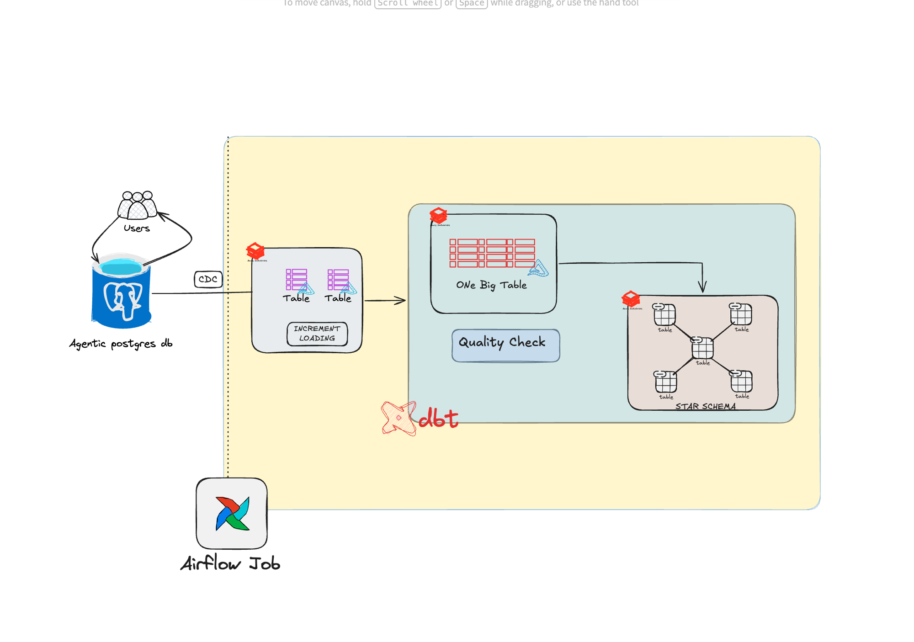

# dataengineering

Data engineering projects — each one self-contained in its own folder.

| project | stack | what it does |
|---|---|---|
| [**walmart-lakehouse**](walmart-lakehouse/) | Airflow · dbt · Databricks · Postgres CDC | Medallion pipeline: CDC from operational Postgres → bronze → silver (incremental `MERGE`) → gold star schema, orchestrated by Airflow |

Each folder has its own README with setup steps and architecture.

## walmart-lakehouse

CDC out of an operational Postgres lands in Databricks bronze. dbt incrementally
loads it to silver — first per-table (`silver_t`), then a denormalised One Big Table
(`silver_b`) — runs quality checks, and models a star schema in gold. Airflow drives
the sequence end to end.

See [walmart-lakehouse/README.md](walmart-lakehouse/README.md) for setup and details.
